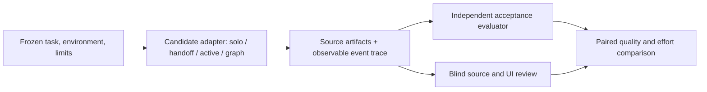

**Orchestration Bench upgrade investigation — September 20, 2026**

**Recommendation: extend the bench to measure execution structure, verification, and recovery. Keep its scoring independent of the orchestration being tested.** Preserve Astra low solo as the practical baseline, add a graph-based candidate, and use controlled comparisons to discover whether any gain comes from parallelism, a reviewer, extra computation, or a different model.

This was a read-only investigation of the existing bench. Its nine pilot runs remain prepared and unstarted. This report is outside the frozen bench directory so it does not change the pilot's policy hashes.

**What the posts contribute**

The [August 1 article](https://x.com/rvaniaaaa/status/2083542830086000704) proposes explicit dependencies, structured worker outputs, parallel work where independent, separate verification, and bounded discovery. The [September 18 follow-up](https://x.com/rvaniaaaa/status/2101020803487703089) lists seven frameworks and emphasizes persisted state and recovery. These are useful design hypotheses; neither post supplies a controlled comparison answering whether your setup beats Astra low.

Source access: X returned 403. I recovered the article, embedded code, and follow-up text from the public FxTwitter API for the exact post IDs, then checked relevant product claims against official documentation and repositories. The accompanying video was not used as evidence. Star counts, download counts, and customer logos were not used to rank frameworks.

**What the current bench can and cannot establish**

The existing design already provides useful controls: independent starting repositories, source hashes, fixed acceptance checks, first/repair snapshots, blind export packages, and separate quality/resource reporting. Keep these.

| Observed implementation | Consequence | Upgrade |
|---|---|---|
| `start()` records the clock and setup; it does not launch or observe an agent | The bench depends on manually reported behavior and effort | Import native execution traces first; add runner adapters when justified |
| Only first and repaired submissions are captured | It cannot identify which delegation, handoff, or review caused a defect | Store node attempts, artifact identities, and dependency events |
| Resource recording is phase-level and manual | It cannot distinguish useful worker effort from coordination overhead | Attribute measured usage to planner, worker, reviewer, integration, and retry |
| Time allowance is checked at capture | It reports overruns after they happen | Add bounded launch/retry policies to automated adapters; label manual runs as unenforced |
| Three small tasks exercise one small app | They may be too easy or too coupled to distinguish graph strategies | Retain them as controls; add width, integration, and recovery cases |
| Method order uses `% 3`; prompts and evaluator IDs explicitly enumerate three modes/scenarios | Adding a fourth method or new task is not just a JSON edit | Introduce method/scenario registries and a schedule generator for arbitrary counts |
| Bench masking is an operator UI; API state still includes identities | The switch does not enforce reviewer isolation | Keep exported packages; add a separate review-only data projection if automating review |

Code evidence: [run preparation and scheduling](https://github.com/shelbyklein/testbench/blob/main/orchestration-bench/bench.py#L109), [launch templates](https://github.com/shelbyklein/testbench/blob/main/orchestration-bench/bench.py#L144), [start/capture/evaluation](https://github.com/shelbyklein/testbench/blob/main/orchestration-bench/bench.py#L188), [phase metrics](https://github.com/shelbyklein/testbench/blob/main/orchestration-bench/bench.py#L250), [operator data projection](https://github.com/shelbyklein/testbench/blob/main/orchestration-bench/bench.py#L287), and [fixed scenario dispatch](https://github.com/shelbyklein/testbench/blob/main/orchestration-bench/evaluator/checks.mjs#L9).

**The architecture I would use**

The candidate may create its own graph. The bench should record the proposed graph and the graph actually executed without requiring every candidate to use the same decomposition. Fixing the decomposition would measure execution of a supplied plan, which is a different experiment from measuring orchestration quality.

A graph-aware event record should carry run ID, node ID, attempt ID, parent/dependency IDs, role, requested and effective model/settings, context/session identity, source revision, input/output artifact hashes, timestamps, status, and measured usage with its source. Record observable actions and artifacts; private model reasoning is unnecessary.

Treat file ownership and resource limits as dependencies too. Two workers with disjoint prompts can still conflict through the same schema file, database, or API quota. For coding workers, use separate workspaces and one explicit integration owner. At a merge, reconcile expected node IDs against completed, failed, canceled, and deliberately skipped IDs. Never silently drop missing work and present complete coverage.

Separate two kinds of reviewer. A reviewer used by a candidate to improve its implementation is part of that candidate's time and cost. The external evaluator must remain identical across methods and must not feed hidden acceptance results into one candidate's first attempt.

For an internal verification experiment, give the reviewer a fresh session containing the specification, relevant source/diff, and reproducible evidence. Measure whether it finds real defects and whether the subsequent fixes introduce regressions. A fresh context reduces shared conversational framing; it does not guarantee independent errors or correctness.

**Changes to the experiments**

Keep two distinct questions visible:

- **Practical choice:** which of your complete setups produces the best accepted work for the effort? Keep the three original methods and add a scripted graph candidate.
- **Causal explanation:** does orchestration help with a fixed implementer and harness? Pin the worker model/settings/tools/environment, and pin the planner/reviewer models wherever those roles are used. Compare solo, written plan, active direction, and a scripted graph. Vary model tiering in a later experiment.

A particularly useful small ablation is solo versus graph, each with and without the same separate internal reviewer. That tests whether an apparent orchestration gain is primarily a review gain. Charge all participating agents to the same recorded resource budget and keep the final external evaluator constant.

Run repeated, fresh attempts on paired tasks. Report raw wins/losses/ties, acceptance, serious defects, and resource distributions; uncertainty should reflect both task diversity and repeat variation. Repeating one task does not create many independent task types. If all methods pass, increase difficulty in a separately versioned suite rather than declaring the methods universally equivalent.

Anthropic's own engineering account distinguishes highly parallel research from coding tasks with fewer independent components, and identifies substantial token overhead in multi-agent work. That supports testing task shape instead of assuming that more agents improve every task. [Primary engineering account](https://www.anthropic.com/engineering/multi-agent-research-system).

**Additional scenarios worth preparing**

These are proposed scenario designs, not implemented fixtures or validated difficulty levels.

| Scenario | Controlled work | Quality evidence | Orchestration evidence |
|---|---|---|---|
| S4: Broad bug audit | A larger fixture with independent modules, known seeded defects, and plausible nonbugs; submit structured findings and reproductions | Correct findings, missed defects, false positives, severity accuracy | Coverage, duplicate findings, reviewer rejection accuracy, aggregation omissions |
| S5: Shared-contract migration | Several consumers need an API/schema migration; some can change independently, others depend on the shared contract | End-to-end compatibility, data preservation, regression tests, maintainability | Incorrect dependency ordering, conflicting writes, integration/rework cost |
| S6: Interrupted implementation | A feature with a predetermined transient tool failure and restart at an equivalent semantic milestone | Final accepted behavior, no lost data or duplicated side effects | Recovery success, healthy artifacts reused, repeated work and recovery cost |
| S7: Discovery and stopping, optional | A seeded audit where rounds reveal more issues and repeat some rejected claims | Final precision/recall and no false completeness | Duplicate suppression, stopping reason, failure-versus-empty distinction, adherence to limits |

Keep S1 as a small-task control. Do not manufacture parallel work where one short fix is the right approach. Preserve S2/S3 for transactional correctness and UX judgment. For S4/S7, the number of reported findings is not itself a success metric; use an independent defect inventory and reproducible behavior. For S6, trigger failures by a comparable work milestone, not “after three agents,” which would disadvantage or exclude solo runs.

Add measures that explain quality: defect escape rate, verifier precision and recall, post-review regression count, missing required artifacts, and recovery correctness. Add timing measures separately: dependency waiting, resource queueing, integration time, and the observed critical path. Avoid a single combined score that allows speed to hide a broken requirement.

**Framework findings**

These are fit assessments from documentation and source descriptions, not installed/runtime-verified integrations.

| Option | What I verified | Fit for this bench |
|---|---|---|
| [LangGraph](https://docs.langchain.com/oss/python/langgraph/overview) | Explicit low-level orchestration mixing deterministic and agentic steps | Best fit to investigate for a Python execution adapter when durable mixed-provider runs are needed; keep the evaluator outside it |
| [Microsoft Agent Framework](https://github.com/microsoft/agent-framework) | Graph workflows, checkpointing, multiple orchestration patterns, OpenTelemetry, Python/.NET | Credible alternative if that ecosystem becomes relevant; not a necessary dependency for the next bench step |
| [CrewAI](https://github.com/crewAIInc/crewAI) | Role-based Crews plus event-driven Flows with explicit state/control | Useful future method under test; adopting its agent loop everywhere would change the baseline |
| [Agno](https://github.com/agno-agi/agno) | Agent SDK, AgentOS runtime/UI, persistence and tracing | Broader operating platform than the current local benchmark needs |
| [Google ADK](https://github.com/google/adk-python) | Graph runtime, evaluation-related tooling and delegation; described as model/deployment agnostic despite Gemini optimization | A valid future adapter; the post's GCP framing should not be read as a GCP-only restriction |
| [AutoGen](https://github.com/microsoft/autogen) | Maintenance mode; repository directs new users to Microsoft Agent Framework | Do not choose it as this new bench's foundation |
| [Composio](https://github.com/ComposioHQ/composio) | Tool connectivity, authentication, sessions, triggers and sandbox tooling | Solves external-tool access; unnecessary for the self-contained fixture and not interchangeable with the benchmark's graph scheduler |

A framework normally changes more than scheduling: prompts, tools, memory, retries, and model adapters can all change. For a native coding-agent comparison, wrap the existing coding harness where feasible. Replacing it with raw model calls inside a framework creates a different experimental condition and should be labeled accordingly.

**The smallest credible runtime experiment is native Claude workflows.** Official documentation confirms reusable scripts, parallel/pipeline primitives and execution visibility. Important experimental details: `ultracode` also increases reasoning effort; keyword activation differs for noninteractive input; size guidance is advisory; actual model substitution can occur; and resumption can repeat successful agents after a failed one. Record these variables and test actual recovery. Availability in your installed configuration has not been checked. [Claude workflow documentation](https://code.claude.com/docs/en/workflows).

If cross-provider execution and precise durable recovery become necessary, prototype a LangGraph adapter next. Its documented checkpointers preserve graph state and successful pending writes; use persistent storage rather than an in-memory saver when testing process restarts. A checkpoint still does not prove that arbitrary external side effects will never repeat: test idempotency explicitly. [Checkpointer behavior](https://docs.langchain.com/oss/python/langgraph/checkpointers), [persistent versus in-memory storage](https://docs.langchain.com/oss/python/langgraph/persistence).

**Do not copy the article's sample code directly**

I reproduced an identity bug in its discovery example. It filters successful verdicts and then indexes the original findings with the shortened list's indexes. Reject A and accept B, and the code retains A. This is a deterministic JavaScript error, independent of model behavior. Join verdicts to findings by stable ID, and retain the artifact revision being judged.

Other implementation checks I would require:

- Distinguish an empty successful result from a timeout, malformed output, or missing worker. A failed search must not count toward convergence.
- Enforce spend/time, iteration, concurrency, and total-worker bounds in the runner. Prompt text alone is not enforcement.
- Deduplicate within a batch and across rounds. Include source revision or an invalidation rule so a previously rejected finding can be reconsidered when the underlying code changes.
- Validate output schemas, then verify semantics independently. Valid JSON is not proof of a valid finding.
- Let failing behavioral tests block acceptance. Reviewer voting should not overrule a reproducible failure.
- Use per-item streaming when downstream work can proceed independently; retain barriers for cross-item deduplication, comparison, shared-state integration, or other real dependencies. Treat latency improvement as something to measure.

The graph is an execution structure. It does not, by itself, remove metric gaming, correlated errors, weak requirements, or incomplete tests. Those need independent checks and honest reporting. Anthropic's evaluation guidance similarly separates execution, grading, and real outcomes and recommends combining grader types. [Evaluation guidance](https://www.anthropic.com/engineering/demystifying-evals-for-ai-agents).

**Recommended order of work**

| Stage | Deliverable | Acceptance for that upgrade |
|---|---|---|
| 1 — Make comparisons extensible | Method/task registries, balanced scheduling for arbitrary method counts, same-worker experiment definitions | A fourth method and a new fixture can be added without editing controller branches; paired runs preserve task/runtime controls |
| 2 — Observe actual execution | Trace import, node/artifact identities, role-based usage, reviewer-only exports, graph/timeline view | Every required node is accounted for; reported usage reconciles to available source logs; missing telemetry stays unknown |
| 3 — Add the discriminating cases | S4–S6, seeded failure controls, precision/recall and recovery grading | Known-good/known-bad fixtures validate the new graders; failure triggers are comparable for solo and multi-agent runs |
| 4 — Test one graph method | A versioned native workflow, same-worker controls, repeated paired trials | Independent evaluator unchanged; actual settings recorded; any quality gain survives repeat attempts and includes all costs |
| 5 — Add durable automation if warranted | Optional LangGraph adapter with persisted state and replay tests | Interrupted runs recover, repeated effects are detected/prevented, and budget boundaries are demonstrably enforced |

The first useful upgrade is stronger experimental control and trace evidence, followed by harder scenarios. Choosing a framework comes after that. No implementation, dependency installation, model execution, GitHub publication, or modification of the frozen pilot was performed in this investigation.
